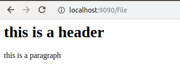
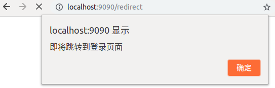
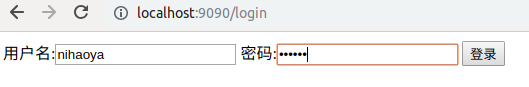
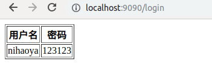
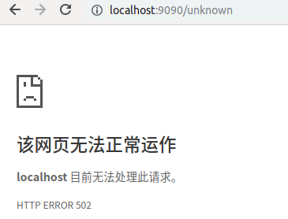

# Go-处理 web 程序的输入与输出

这是一个入门级的Web程序，实现了作业的内容

## 静态文件服务

这里就支持一个小小的HTML文件

```Go
http.HandleFunc("/file", file)         	//静态文件处理
```

```Go
func file(w http.ResponseWriter, r *http.Request){
	t, _ := template.ParseFiles("file.html")
	log.Println(t.Execute(w, nil))
}
```

效果图：



## 支持简单 js 访问

使用JS来实现先弹出提示，然后页面跳转

```Go
http.HandleFunc("/redirect", redirect) 	//通过JS处理重定向
http.HandleFunc("/redirect.js",getJS)
```

```Go
func redirect(w http.ResponseWriter, r *http.Request){
	t, _ := template.ParseFiles("redirect.html")
	t.Execute(w, nil)
}

func getJS(w http.ResponseWriter, r *http.Request){
	t, _ := template.ParseFiles("redirect.js")
	t.Execute(w, nil)
}
```

```html
<!-- redirect.html -->
<!DOCTYPE html>
<html>
    <body>
        <script src="redirect.js"></script>

        <p>欢迎来到星光大道？</p>
    </body>
</html>
```

```javascript
window.alert("即将跳转到登录页面")
window.location.href = "login"
```

效果图：



## 提交表单，并输出一个表格

```Go
http.HandleFunc("/login", login)         //表单处理
```

```Go
func login(w http.ResponseWriter, r *http.Request) {
	fmt.Println("method:", r.Method) //获取请求的方法
	if r.Method == "GET" {
		t, _ := template.ParseFiles("login.gtpl")
		log.Println(t.Execute(w, nil))
	} else {
		//请求的是登录数据，那么执行登录的逻辑判断
		r.ParseForm()
		fmt.Println("username:", r.Form["username"])
		fmt.Println("password:", r.Form["password"])
		fmt.Fprintf(w, `<table border="1"><tr><th>用户名</th><th>密码</th></tr>
		<tr> <td>`+ r.Form["username"][0]+ `</td>
		     <td>`+ r.Form["password"][0]+ `</td>
		</tr>
	  </table>`)
	}
}
```

效果图:





## 对 /unknown 给出开发中的提示，返回码 5xx

```Go
http.HandleFunc("/500",errorPage)		//500错误
```

```Go
func unknown(w http.ResponseWriter, r *http.Request){
	// http.Redirect(w,r,"/500",http.StatusBadGateway);
	log.Println("Bad Gateway!")
	w.WriteHeader(502)
}
```

效果图:

